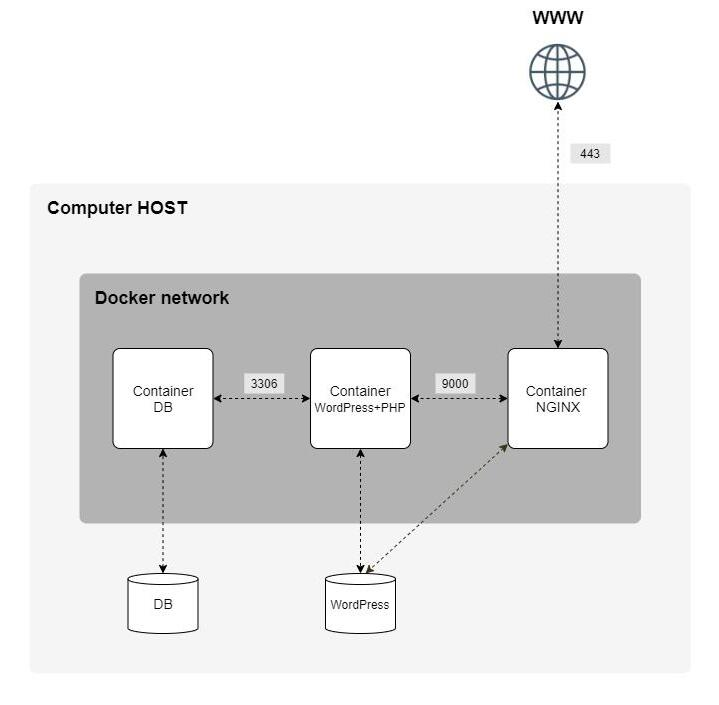

# Inception (42 school)

Inception is a system administration and **DevOps** project, focused on containerization using **Docker** and **Docker Compose**.
It builds a multi-service infrastructure: **WordPress**, **MariaDB**, **Nginx**, **Redis**, **FTP**, **Email catcher** and a **static website** (Python and JS).

View subject [here](subject/en.subject.pdf).


## How to use

1. **Install Docker** ([doc](https://docs.docker.com/engine/install/ubuntu/))

	```bash
	sudo apt-get update
	sudo apt-get install ca-certificates curl
	sudo install -m 0755 -d /etc/apt/keyrings
	sudo curl -fsSL https://download.docker.com/linux/debian/gpg -o /etc/apt/keyrings/docker.asc
	sudo chmod a+r /etc/apt/keyrings/docker.asc
	echo "deb [arch=$(dpkg --print-architecture) signed-by=/etc/apt/keyrings/docker.asc] https://download.docker.com/linux/debian $(. /etc/os-release && echo "$VERSION_CODENAME") stable" | sudo tee /etc/apt/sources.list.d/docker.list > /dev/null
	sudo apt-get update
	```

2. **Setup domains**

	Update `/etc/hosts` and add the following lines:
	```
	127.0.0.1	<eproust>.42.fr
	127.0.0.1	www.<eproust>.42.fr
	127.0.0.1	portfolio.<eproust>.42.fr
	```

3. **Build and run the project**
	```bash
	sudo apt update && apt ugrade && apt install -y git make
	git clone https://github.com/edouardproust/42_inception.git inception
	cd inception
	make secrets # Enter credentials to create 'secrets/' folder and 'secrets/*password.txt' files
	make env # Generate 'srcs/.env' file
	make up
	```
	Use `make help` for the full list of options.

## Tips for building Docker custom images

Building container directly via a Dockerfile is not a good method, because builds and runs take time, and volumes binding can mix things up in the process too.

To build the project, i used the kind-of magic command below. It allows to build the containers step by step.
```bash
docker run --rm -it alpine:3.21.4 sh
```
`3.21.4` being the version of alpine i wanted to use as a base image. So at this point this is the equivalent of having a `FROM alpine:3.21.4` in a Dockerfile.
Then i could install the dependencies, and run commands after command to tests things, seeing missing packages, files ownership issues.
I was replicating in a Dockerfile the succesful commands, and reworking in the temporary `alpine` container for failing commands.

## How to install on a virtual machine (VM)

1. **Create the virtual box**

	- [Download the minimal image ("netinst") of Debian](https://cdimage.debian.org/cdimage/archive/12.9.0/amd64/iso-cd/debian-12.9.0-amd64-netinst.iso)
	- In VirtualBox UI:
		- Click "New"
		- Name and locate the VM, select `.iso` file, check "Skip Unattended Installation" + click "Next"
		- Set hardware (default) + Virtual Hard disk size (20GB) + Click "Finish"
	- OS installation:
		- Select the VM newly created and click "Start"
		- Choose "Graphical install", then set language, location, keyboard type and locals
		- Set hostname, root and create the new user
		- [Create partitions manually](https://www.youtube.com/watch?v=OQEdjt38ZJA), install no dependencies & install GRUB

	For partitioning, I went for this:
	```
	$ lsblk
	NAME                MAJ:MIN RM  SIZE RO TYPE  MOUNTPOINTS
	sda                   8:0    0   20G  0 disk
	|-sda1                8:1    0  476M  0 part  /boot
	|-sda2                8:2    0    1K  0 part
	`-sda5                8:5    0 19.5G  0 part
	`-sda5_crypt        254:0    0 19.5G  0 crypt
		|-LVMGroup-root 254:1    0   13G  0 lvm   /
		|-LVMGroup-swap 254:2    0  952M  0 lvm   [SWAP]
		`-LVMGroup-home 254:3    0  5.6G  0 lvm   /home
	sr0                  11:0    1 1024M  0 rom
	```
	`13Go` (up to 17Go) for `root` allows `docker` to run without having to flush images and volumes too often.

2. **Install sudo**

	- Reboot the VM, enter encryption key, login as `<42_login>`
	- Run commands:
	```bash
	su # then enter root password
	apt update && apt install sudo -y
	sudo adduser <eproust> <sudo>
	```
	- Reboot to see the changes: `sudo reboot`
	- Check groups and users:
	```bash
	getent passwd <eproust> # reads in file /etc/passwd
	getent group <sudo> # reads in file /etc/group
	```

3. **Install SSH**

	```bash
	sudo apt update && sudo apt install openssh-server -y
	sudo service ssh status # check if working
	```
	Set port forwarding:
	- Open `VirtualBox` > Select VM in list > icon `Settings` > menu item `Network` > Select `NAT` > button `Port Forwarding`
	- Create 2 new rules:
		- `Name: SSH, Protocol: TCP, Host: 2222, Guest port: 22` (leave the rest empty)
		- `Name: FTP, Protocol: TCP, Host: 2223, Guest port: 2223` (leave the rest empty)

4. **Connect to Virtual machine from Host**
	```bash
	ssh -p 2222 <eproust>@localhost
	```
	From this terminal, you can now follow the steps of "How to use" part of this readme.

### Credentials

```bash
make secrets # -> create `secrets/` folder + credentials / passwords files
make env # -> create `srcs/.env` file containing credentials
```

Passwords files (`secrets/*password.txt`) are mounted via `docker-compose` for security purpose: passwords are not baked into images nor exposed as plaintext environment variables in running processes.

## Containers

1. Nginx (`nginx`): Proxy server + SSL certificates (details below)
2. Wordpress (`wordpress`): uses PHP-FPM as a PHP runtime and downloads the last version of wordpress. Access: [https://\<eproust\>.42.fr]()
3. Mariadb (`mariadb`): open source database compatible with mysql
4. Redis (`redis`): database serving as cache for the wordpress website (see details below)
5. Adminer (`adminer`): To vizualize database. Access: [https://\<eproust\>.42.fr/adminer]()
6. Static website (`static`): using Flask (python runtime) + Gunicorn server. Access: [https://\<eproust\>.42.fr/portfolio]()
7. SFTP server (`ftp`): Using SSH encryption for security
8. Mailhog (`mailhog`): Mail catcher (for dev environment). Acces: [https://\<eproust\>.42.fr/mailbox]()



### Nginx

Configuration file (`nginx.conf`):
- Servers:
	1. HTTP to HTTPS redirection
	2. Main domain `<eproust>.42.fr` and subdomain `www.<eproust>.42.fr` both redirect to the wordpress website
	3. Subdomain `portfolio.<eproust>.42.fr` redirects to the static website
- Using custom configuration for `wordpress` container: **nginx works as a server in this case**
- Using `proxy_pass` for `adminer`, `mailhog` and `static` website containers: **nginx serves just as a proxy here**. Indeed all these 3 containers already have their own server:
	- `adminer`: PHP FPM (`php-fpm83 -F`). Ran as `www-data` user
	- `mailhog`: Mailhog integrated server (`mailhog`). Ran as `root` = for development only!
	- `static` website: Flask built-in server (`"flask run" --host=0.0.0.0 --port=5000`). Ran as `flask` user

### Wordpress

#TODO
Setup:
- Ran as `www-data:www-data` user

### Redis

#TODO

### SFTP server

In terminal:
```bash
sftp -P 2223 <FTP_USER>@localhost
# Then enter password + FTP commands, example:
# sftp > get <filename>
# sftp > quit
```

Using Filezilla:
```bash
Host: localhost
Port: 2223
Protocol: SFTP
User: <FTP_USER> (defined in .env)
Password: <FTP_PASS> (defined in .env)
```

Setup / Challenges:
- Using `openssh` for ftp server and SSH encryption.
- **User id** and **group id** had to match the ones used in `wordpress` container because both `ftp` and `wordpress` containers share the same named volume `inception_wordpress-data`.
- Folders and files rights: in order to work, `openssh` needs that all users have at least execution and reading rights, meaning `chmod 755` for the root folder and `700` for the folder accessible by the ftp user.
- Ports mapping / forwarding: `ftp container` (port 22) -> `virtual machine` (port 2223) -> host machine (port 2223)

## Ressources

- [Docker Crash Course for Absolute Beginners](https://www.youtube.com/watch?v=pg19Z8LL06w) (by TechWorld with Nana)
- [Docker in 1 hour](https://www.youtube.com/watch?v=GFgJkfScVNU) (by Javascript Mastery)
- [Docker cheatsheet](https://docs.docker.com/get-started/docker_cheatsheet.pdf)
- [Docker compose](https://devopscycle.com/blog/the-ultimate-docker-compose-cheat-sheet)
- [NGINX documentation](https://nginx.org/en/docs/index.html)
- [Github repo](https://github.com/ApplexX7/Inception-1/tree/main)
